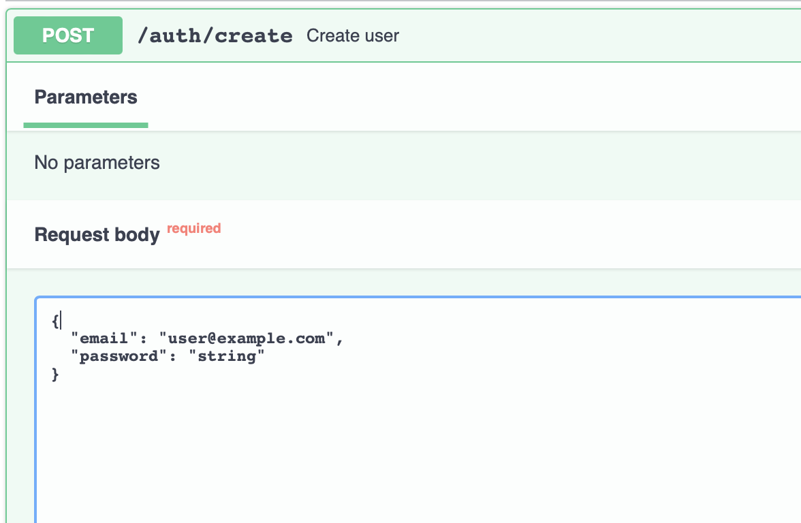

    
    
    
    
    
    

## Клонируем репозиторий:

    git clone https://github.com/Mitsufiro/task_kefir

## Развертывание

`docker-compose up`

## Migrations

При изменении модели данных необходимо создать миграцию

`docker exec app alembic revision --autogenerate -m "New Migration"`

Для применения изменений, необходимо запустить

`docker exec app alembic upgrade head`

* Создание юзера с минимальноц информацией о нем. Оставляем только те поля которые хотим занести в базу данных.

* При входе заполняем данные пользователя и просто берем access token, который нам необходим для использования методов.

* Далее в зависиммости от прав юзера можем использовать методы.

## Finally:

• Реализован ролевой доступ к API-методам в зависимости от уровня прав пользователя.

• Настроена валидация данных.

• Swagger.

• Подготовлен docker-контейнер с сервисами.

• Универсальный CRUD.

• Реализация асинхронных методов.

• Настроено опциональное изменение данных пользователей (Чтобы изменить нужное поле необходимо оставить только его).

• Настроена аутентификация (Доступ к методам производится путем подачи токена со стороны пользователя).

• Код отредактирован (flake8, black, isort).

